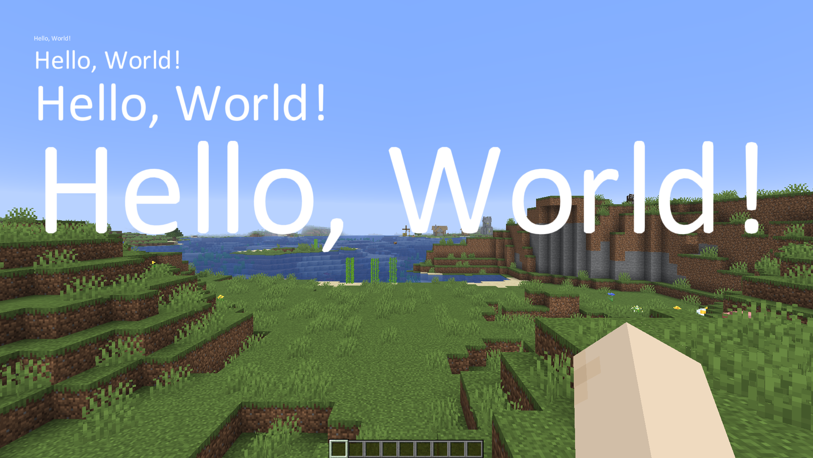

You can generate your own MSDF atlas using msdf-atlas-gen: https://github.com/Chlumsky/msdf-atlas-gen Make sure your charset starts at 0x20, so it aligns with Java's char implementation

If you don’t want to generate anything yourself, the mod already includes a few prebaked fonts. You can access them through DefaultFonts.java

To render text, create an McsdfFontRenderer and call its methods:

# Code example

```java
FontRenderer fr = new FontRenderer(DefaultFonts.ARIAL, 100);

fr.text(graphics, "Hello", 20, 20, 0xFFFFFFFF);
fr.centeredTextW(graphics, "Scaled text", 40, 60, 0xFFFF0000);
fr.centeredTextWH(graphics, "Centered", width / 2f, height / 2f, 0xFF00FFFF);
```

# File structure

MSDF shader -> src\main\resources\assets\mcsdf\shader\

Fonts -> src\main\resources\assets\fonts\

# Showcase

MSDF allow for rendering of text at all scales. Here are some examples:

